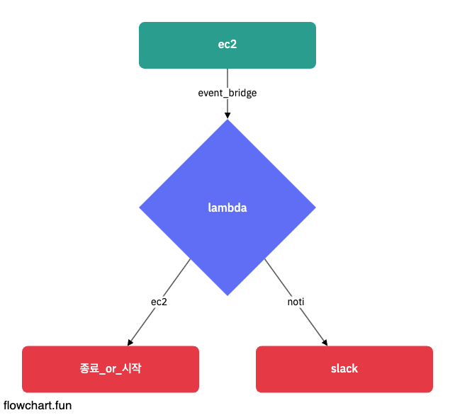

# Handling Cron-EC2

## Architecture



## Desc

- 09:00, 18:00 까지만 동작하는 인스턴스 구조입니다.
- aws_scheduler_schedule 의 cron 기능을 사용합니다.
- Terraform + Lambda (Golang) 사용하여 구현합니다.

## Folders

```
    infra
        |-- ec2.tf
        |-- event-bridge.tf
        |-- lambda.tf
    function
```

## Execution

1. .tfvars 작성 (./infra/tfvars.examples 참고)

2. Terraform + Provisioning

```sh

    ## Provisioning
    cd infra
    tf init
    tf plan -var-file=[tfvars file] OR Make plan
    tf apply -var-file=[tfvars file] OR Make apply

    ## Lambda Function Update
    cd function
    make run
```
